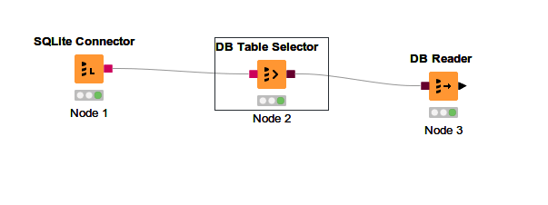

# Excercise Knime - Big Data
## Excercises 1 - DB
### DB Connect

1. Tambahkan SQLite connector, konfigurasikan sesuai dengan file yang telah didownload
2. Tambahkan DB Table selector untuk menselect table \[nrp\]_ss13pme
3. Tambahkan DB Reader untuk membaca tabel tersebut sehingga masuk ke dalam Workflow Knime
4. Execute

Workflow final :
  

### InDB Processing

1. 
   1. Tambahkan DB Column filter untuk masing-masing node guna menfilter kolom PUMA* dan PWGTP* (setting menggunakan RegEx (?!puma|pwgtp).* )
   2. Tambahkan DB Joiner dari dua column filter tadi, lalu join di column serialno
   3. Tambahkan DB reader.
2. 
   1. Tambahkan DB Row filter menyambung ke hasil filter dari tabel ss13pme.
   2. Konfigurasikan agar DB mengambil row dengan syarat COW IS NOT NULL
   3. Tambahkan DB Reader
3. 
   1. Tambahkan DB Row filter menyambung ke hasil filter dari tabel ss13pme.
   2. Konfigurasikan agar DB mengambil row dengan syarat COW IS NULL
   3. Tambahkan DB Reader 
4. 
   1. Tambahkan DB GroupBy menyambung ke hasil filter dari tabel ss13pme.
   2. Konfigurasukan agar GroupBy mengambil group kolom 'sex' dan mengambil kolom agep sebagai aggregasi rata-rata
   3. Tambahkan DB Reader
5. Execute

Worfklow final :
  

### Modelling