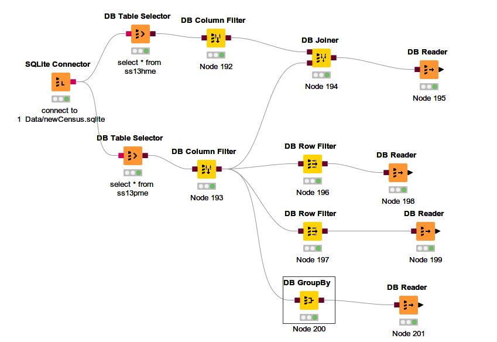
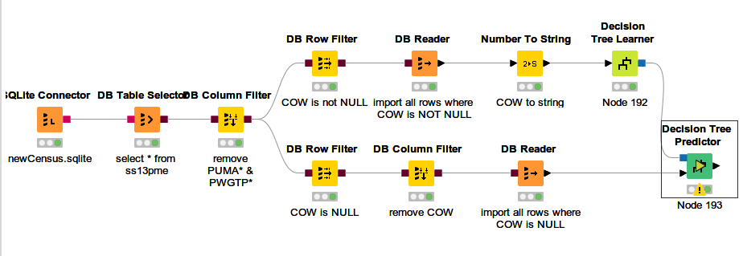
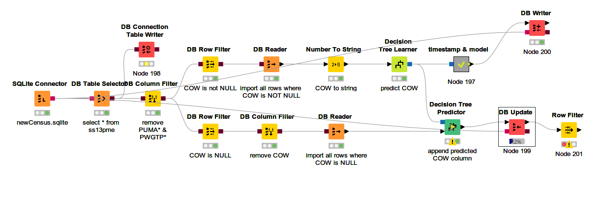

# Excercise Knime - Big Data
## Excercises 1 - DB
### DB Connect

1. Tambahkan SQLite connector, konfigurasikan sesuai dengan file yang telah didownload
2. Tambahkan DB Table selector untuk menselect table \[nrp\]_ss13pme
3. Tambahkan DB Reader untuk membaca tabel tersebut sehingga masuk ke dalam Workflow Knime
4. Execute

Workflow final :
  

### InDB Processing

1. 
   1. Tambahkan DB Column filter untuk masing-masing node guna menfilter kolom PUMA* dan PWGTP* (setting menggunakan RegEx (?!puma|pwgtp).* )
   2. Tambahkan DB Joiner dari dua column filter tadi, lalu join di column serialno
   3. Tambahkan DB reader.
2. 
   1. Tambahkan DB Row filter menyambung ke hasil filter dari tabel ss13pme.
   2. Konfigurasikan agar DB mengambil row dengan syarat COW IS NOT NULL
   3. Tambahkan DB Reader
3. 
   1. Tambahkan DB Row filter menyambung ke hasil filter dari tabel ss13pme.
   2. Konfigurasikan agar DB mengambil row dengan syarat COW IS NULL
   3. Tambahkan DB Reader 
4. 
   1. Tambahkan DB GroupBy menyambung ke hasil filter dari tabel ss13pme.
   2. Konfigurasukan agar GroupBy mengambil group kolom 'sex' dan mengambil kolom agep sebagai aggregasi rata-rata
   3. Tambahkan DB Reader
5. Execute

Worfklow final :
  

### Modelling
1. Tambahkan Decision Tree Learner dan sambungkan ke number to string.
2. Jalankan decision tree learner
3. Tambahkan Decision Tree predictor dan sambungkan interface berbentuk segitiga ke DB Reader bagian bawah dan satunya lagi ke decision tree learner
4. Konfigurasi prediction column name menjadi cow(agar ter append)

Workflow final:
  

### Writing to DB
1. Tambahkan DB Connection Table Writer dan sambungkan ke DB table selector.
2. Konfigurasikan tabel baru menjadi <nama tabel\>_original untuk disimpan sebagai backup 
3. Tambahkan DB Writer yang akan menwrite model decision tree
4. Tambahkan DB Update yang akan mengupdate row yang sesuai setelah di predict nilai COW nya
5. Tambahakn row filter untuk melihat update status dari DB update, memastikan jalannya update berhasil

Workflow final:

## Excersises 2 - Hadoop